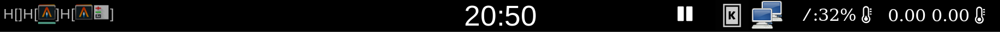
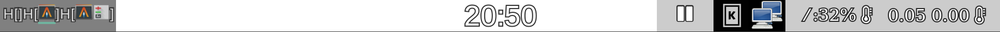

# rwaybar

A taskbar for Wayland written in Rust.  Works on any compositor supporting
the layer\_shell protocol (sway, most wlroots window managers, kwin).

## Available Modules

- Clipboard (viewer)
- Clock and calendar
- Custom scripts or dbus API queries
- Disk (filesystem) free
- Icons (including custom images)
- File reader (for showing battery, temperature, load average, etc.)
- MPRIS-compliant media player support (title display, basic control)
- Pipewire and Pulseaudio volume and mute controls
- Sway (window tree, workspaces, binding mode)
- Tray

See the [configuration documentation](doc/config.md) for details.

## Other Features

- Clicks can execute custom scripts or provide input to existing ones
- Support for showing meters by choosing or fading between multiple images or glyphs.
- Reformatting of values using regular expressions and/or numeric expressions
- Config reload on SIGHUP

## Building

```bash
cargo build --release
cp doc/rwaybar.toml ~/.config/
./target/release/rwaybar
```

You should modify the example config to match your outputs and to configure
where and what you want on your bar.  Specify the environment variable
`RUST_LOG=debug` to enable more verbose debugging.

You can also enable or disable some features using cargo's feature flags.
Currently there are two features:

- `dbus` - Enable dbus support.  Required for MPRIS and tray; enabled by default.
- `pulse` - Enable pulseaudio support. Not enabled by default; requires pulse libraries.

## Samples





These two samples are using the same configuration, only the background color
differs.  I like a transparent background on my taskbar, but I also configure
my desktop background to be a slideshow.  This means that I need the bar to be
readable regardless of the color of the background, which was done in this
example by using text-outline.  The tray needs a solid background because some
icons (kdeconnect, steam) aren't otherwise visible on light backgrounds.

Note: these images were captured on a scaled (HiDPI) output, which is why they
appear double the size defined in the sample bar configuration.

## Motivation

This started out as a 'how does wayland work, anyway?' project.  I then decided
that I liked the look of a transparent bar, and started adding features like
text-outline to make the output more readable, and adding modules to display
more data.  I later decided to remove the C library dependencies that could be
replaced by rust-native ones.
